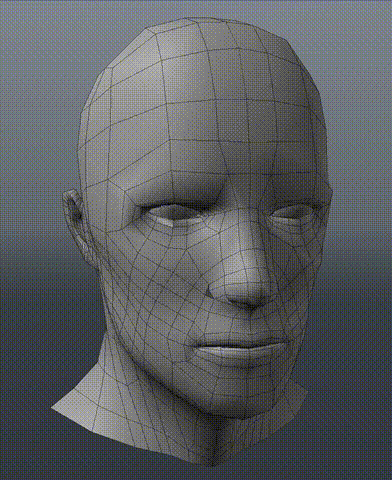
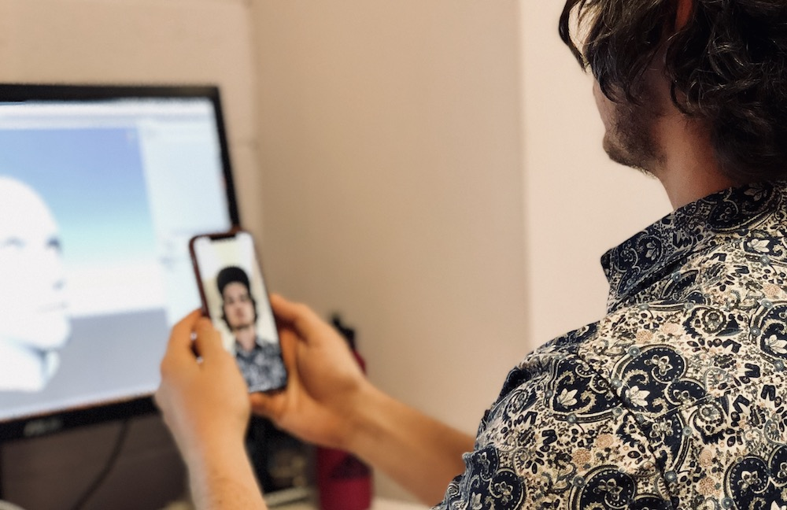

# Real-time Facial Performance Capture with iPhone X #

When Apple announced iPhone X and Animoji the first thought we had was: can we use this to animate arbitrary 3D characters? That is, not just the Animoji designed by Apple.

It turns out that yeah, not only is this possible. It's pretty easy and the ARKit face APIs are powerful enough to produce useful animation. And we can capture it in real-time.

We're going to cover the following:

* Apple's blend shapes
* Building the blend shapes on our model
* Our iOS app to transmit the blend shapes over UDP
* The Unity extension to receive the data from our iOS app
* Source code for both projects

The result is the ability to stream blend shape parameters live from your iPhone X into Unity to control your animation rig.

<video controls="controls" width="1280" height="720" name="Video Name" src="images/img_face_resultlivesmall.mov"></video>

### Hasn't this been done? ###

There was a [recent article](http://prostheticknowledge.tumblr.com/post/167520295696/iphone-x-face-motion-capture-into-houdini-were) showing the 3D output from the iPhone X front camera module. It shows the raw vertex data captured from iPhone X and put into Houdini (3D animation software). What we wanted, however, was to get the facial motion data itself and re-target it to an arbitrary 3D model.

So, for example, you would be able to perform your in-game character's lip sync and facial expressions just by holding your iPhone X up to your face. Or maybe you could animate a character for a TV series.

Current automated facial animation techniques analyse voice data for phonemes (e.g., `ee`, `oo`, `ah`) and map those sounds to 3D model blend shapes. We figured the iPhone X could produce more dynamic facial expressions, including brow movement, blinking, nose flaring, and eye lid movement.

### Retargeting Facial Motion to a Mesh Using iPhone X ###

It turns out that ARKit not only gives you the raw vertex data computed from your face, it gives you a set of blend shape values. Blend shape values are just numbers between 0.0 and ¡1.0 that tell you how much ARKit thinks a certain muscle in your face is moving.

So, for example, the `Jaw Open` blend shape would be 0.0 when your jaw is closed, and 1.0 when your jaw is open. Any value in-between would indicate a partially open jaw.

This is really powerful because if you are a 3D artist not only can you map Apple's blend shapes to your 3D character, you can design an animation rig around the various values. For example, maybe you have a cartoon fox with pointy ears, when you detect a frown you could automatically turn the ears downwards (in fact, Apple does this with their own Animoji).

### Making the Morph Targets ###

The most labour intensive part is mimicking Apple's morph targets on your custom 3D mesh.

There are *a lot* of blend shapes.

In total there are [51 blend shapes](https://developer.apple.com/documentation/arkit/arfaceanchor.blendshapelocation) including things like `eyeBlinkLeft`, `eyeWideRight`, `mouthFunnel`, `mouthLowerDownLeft` and so on. Most of these are symmetrical in that they have left and right equivalents.

Here are the blend shapes we made for our sample model. These are fairly basic and were made quickly so we could test the validity of the idea. Your own custom models could have much nicer, more intricate blend shapes.

### How does it work? ###

The demo consists of two parts. The iOS app and the Unity extension host.

#### iOS App  ####

You can get it here: [github.com/johnjcsmith/iPhoneMoCap](https://github.com/johnjcsmith/iPhoneMoCap)

The iOS app streams the Blend Shapes Apple provides in `ARFaceAnchor.blendShapes` to the Unity host through a UDP socket. Essentially emitting a stream of messages, each with 50 blend shapes in the format `'blend-shape-name:blend-shape-value'`.

There are lots of performance improvements to be made here but it works for the purpose of a demo.

#### Unity Extension Host ####

You can get it here: [github.com/johnjcsmith/iPhoneMoCapUnity](https://github.com/johnjcsmith/iPhoneMoCapUnity)

Inside of the Unity host we have an extension which opens up a UDP socket to listen for the iPhone's messages. When it receives a message it applies the blend shape values to the corresponding blend shape on the rig.

The Unity extension targets a `SkinnedMeshRenderer` with the name `blendShapeTarget` which

### How to run the project ###

* Clone and open the Unity project from [here](https://github.com/johnjcsmith/iPhoneMoCapUnity).
* Run the Unity project's scene
* In the menu bar select `iPhoneMoCap` -> `MeshPreview`
* Enable Mesh preview
* Grab the iOS app project from [here](https://github.com/johnjcsmith/iPhoneMoCapiOS)
* Make sure your iPhone X is connected to the same Wifi network and build / run this application. (Don't forget to pod install)
* This application should discover the unity host and begin streaming the motion data.
